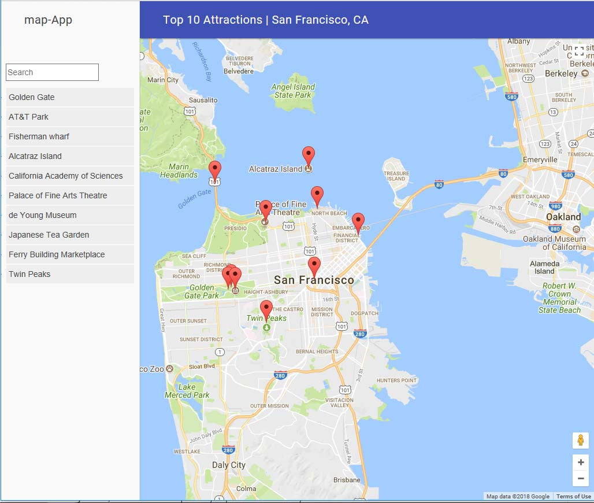

## Neighbourhood Map – San Francisco
This is a single page application featuring a map of top 5 locations in San Francisco. This app is built for a Neighbourhood map project which is a part of the Full Stack Web Development Nanodegree at Udacity.

## Libraries, frameworks and APIs used
1. Knockout JS
Knockout Js can be either downloaded from http://knockoutjs.com/ or can use CDN https://cdnjs.cloudflare.com/ajax/libs/knockout/3.4.2/knockout-min.js
2. Google Maps
In order to get map google map functionality google map API is required. Full instruction on google map API can be found at https://developers.google.com/maps/documentation/embed/get-api-key
3. Foursquare
This project also use third party API that is four square. Details about foursquare API can be found at https://developer.foursquare.com/docs/api/getting-started

Basic Instructions
1.	Download the zip to a directory you'll be working in.
2.	Unzip the file.
3.	Open the index.html in a modern browser.
4.	Click markers or list items to select a location and retrieve info about it.
5.	Type into the filter/search box to filter the shown locations.

